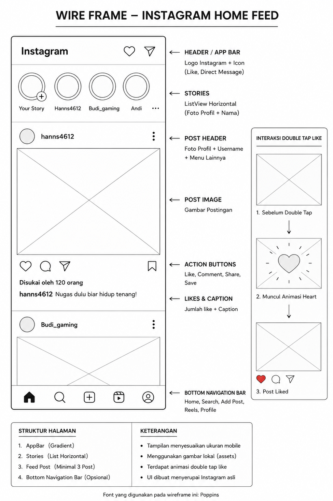

# Tugas UI/UX Flutter — Instagram Home Feed

## Identitas
- **Nama:** Raihan
- **NIM:** 24555201110021
- **Pilihan:** B (Instagram)

---

## Deskripsi Singkat

Pada tugas ini saya membuat tampilan UI aplikasi Instagram Home Feed menggunakan Flutter.  
Halaman yang dibuat terdiri dari:

- Story Instagram horizontal
- Feed postingan Instagram minimal 3 post
- Tombol like, comment, dan share
- Animasi double tap like
- Tampilan responsive seperti mobile di browser Chrome

Project dibuat menggunakan struktur folder Flutter yang rapi dengan pemisahan halaman dan widget agar mudah dikelola.

---

## Widget yang Digunakan

| Widget | Fungsi |
|---|---|
| `MaterialApp` | Root aplikasi Flutter |
| `Scaffold` | Struktur utama halaman |
| `AppBar` | Header aplikasi |
| `Column` | Menyusun widget secara vertikal |
| `Row` | Menyusun widget secara horizontal |
| `ListView` | Menampilkan story secara horizontal |
| `SingleChildScrollView` | Membuat halaman dapat di-scroll |
| `CircleAvatar` | Menampilkan foto profil/story |
| `Image.asset` | Menampilkan gambar dari folder assets |
| `GestureDetector` | Mendeteksi double tap like |
| `AnimatedOpacity` | Animasi icon hati saat like |
| `SizedBox` | Memberikan jarak/spasi |
| `Padding` | Memberikan ruang pada widget |
| `RichText` | Membuat caption dengan style berbeda |
| `Icon` | Menampilkan icon Instagram |
| `Container` | Membungkus widget dan dekorasi gradient |

---

## Screenshot

---

## Wireframe

---

## Kesulitan yang Ditemui

### 1. Struktur Folder Flutter
Awalnya seluruh kode ditulis di `main.dart`, namun kemudian dipisahkan menjadi:
- `pages/`
- `widgets/`

agar kode lebih rapi dan sesuai standar Flutter.

### 2. Menggunakan Gambar Lokal
Awalnya gambar menggunakan URL internet, lalu diganti menjadi gambar lokal menggunakan folder `assets/images/`.  
Kesulitannya adalah konfigurasi `pubspec.yaml` yang harus memiliki indentasi benar.

### 3. Animasi Double Tap Like
Animasi like membutuhkan perubahan dari `StatelessWidget` menjadi `StatefulWidget` agar state like dapat berubah saat gambar di-double tap.

### 4. Tampilan Mobile di Chrome
Saat dijalankan di Chrome ukuran tampilan terlalu lebar seperti desktop.  
Solusinya menggunakan `SizedBox(width: 400)` agar tampilan tetap menyerupai ukuran mobile.

---

## Link Repository GitHub

https://github.com/username/tugas-ui-flutter